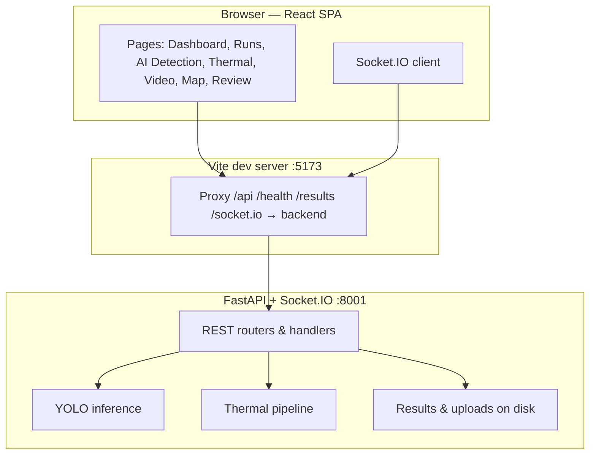
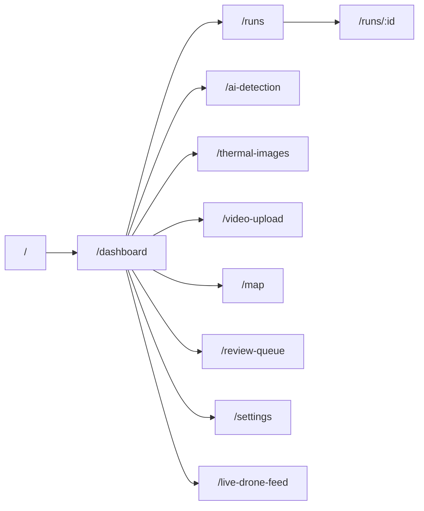
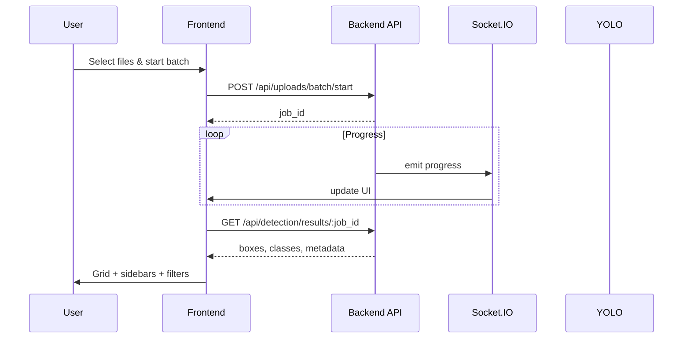
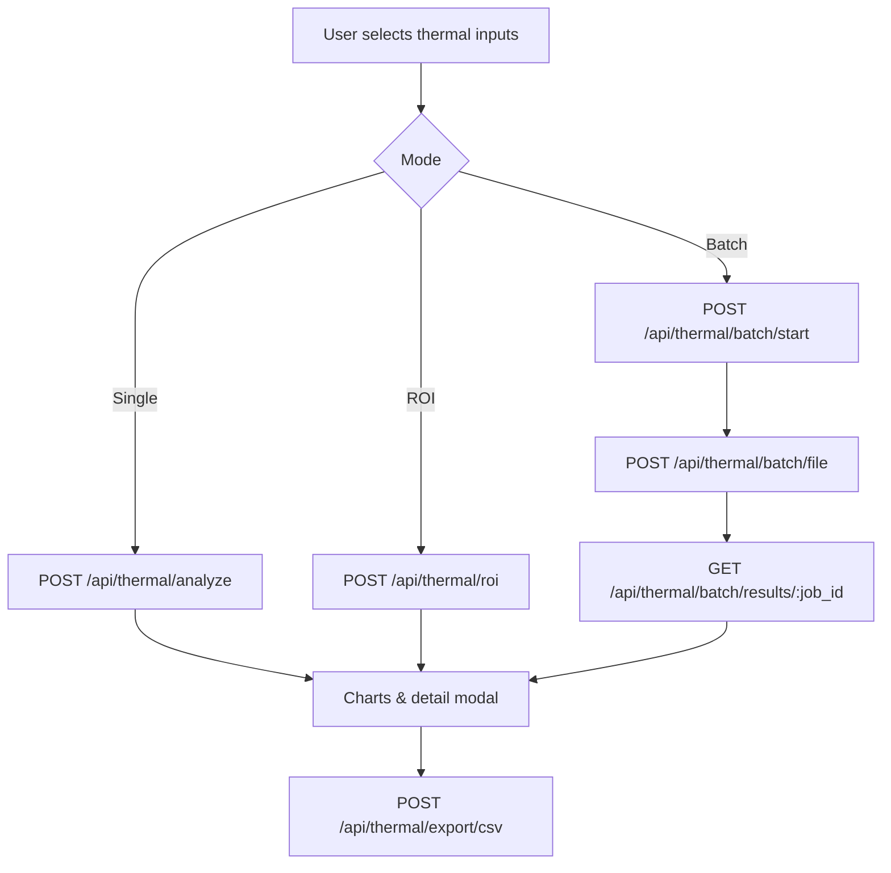
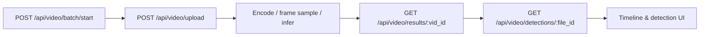
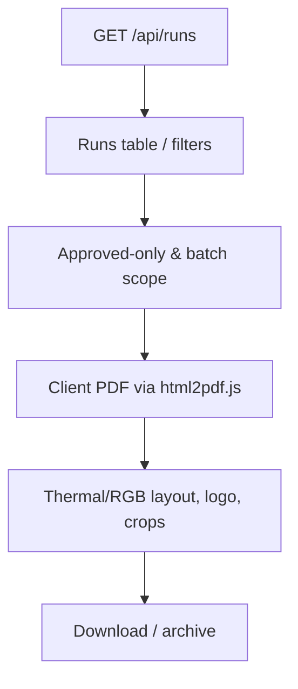
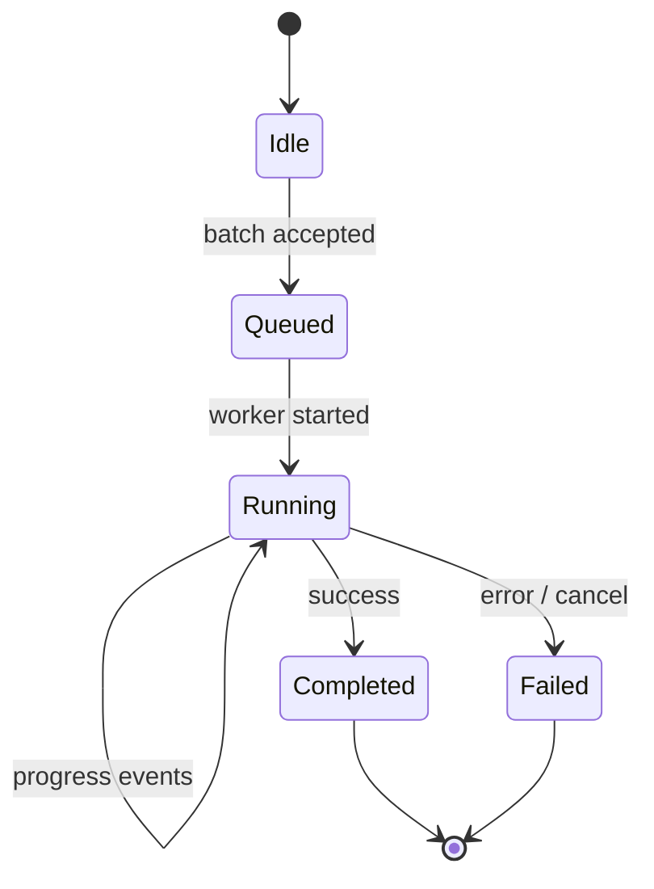
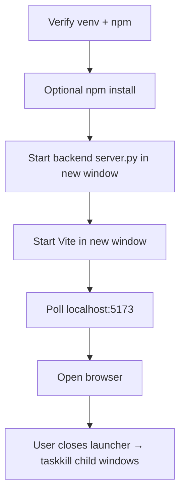
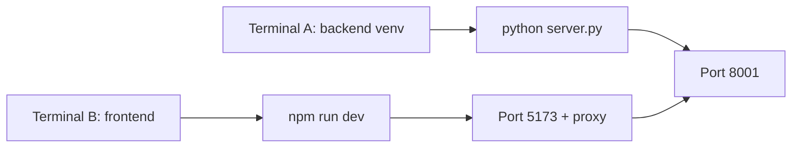
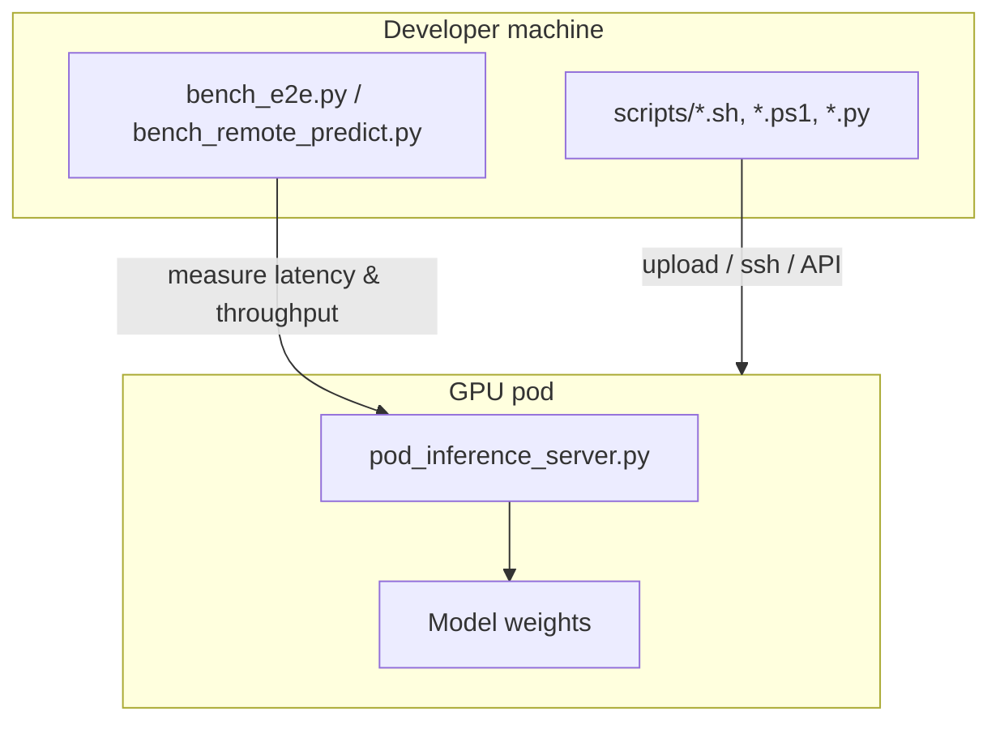

# Azeri Energy Dashboard v3

A full-stack energy-infrastructure inspection platform for **AI-assisted defect detection**, **thermal analysis**, **video batch inference**, and **operational reporting**. The application pairs a **React (Vite + TypeScript)** frontend with a **Python FastAPI** backend, real-time progress over **Socket.IO**, and optional **GPU / cloud (RunPod)** workflows for heavier models.

---

## Table of contents

1. [Overview](#overview)
2. [What is new in v3](#what-is-new-in-v3)
3. [Architecture](#architecture)
4. [Feature areas](#feature-areas)
5. [Flow diagrams](#flow-diagrams)
6. [Changelog & evolution tables](#changelog--evolution-tables)
7. [Repository layout](#repository-layout)
8. [Prerequisites](#prerequisites)
9. [Local setup](#local-setup)
10. [Running the stack](#running-the-stack)
11. [API surface (summary)](#api-surface-summary)
12. [Optional: RunPod & bench scripts](#optional-runpod--bench-scripts)
13. [Troubleshooting](#troubleshooting)

---

## Overview

**Azeri Energy Dashboard v3** is designed for teams that inspect power-line and related assets using RGB imagery, thermal data, and video. Operators can upload batches, monitor jobs in real time, review detections with filters and sidebars, manage an approval queue, export **PDF reports** (including thermal/RGB layouts), and browse historical **runs** with summaries suitable for demos and audits.

| Layer | Technology | Responsibility |
|--------|------------|----------------|
| **UI** | React 18, Vite 7, TypeScript, Tailwind, Recharts, Leaflet | Dashboards, uploads, review, maps, PDF generation (client-side) |
| **API** | FastAPI, Uvicorn | REST endpoints for uploads, results, thermal, video, runs |
| **Real-time** | python-socketio + socket.io-client | Batch progress, live job updates |
| **ML** | PyTorch / YOLO (Ultralytics-style stack in `requirements-*`) | Defect detection on images and video frames |
| **Thermal** | Backend thermal helpers | ROI, batch thermal jobs, CSV export |

Default **HTTP** listen port in this tree is **8001** (overridable with `PORT`). The Vite dev server proxies `/api`, `/health`, `/results`, and `/socket.io` to that backend.

---

## What is new in v3

Compared with earlier iterations (internally referenced as v2 / demo baseline), v3 emphasizes **polished UX**, **dependable Python dependencies**, **thermal + RGB reporting**, **runs-centric PDFs**, **class filters and detection sidebars**, **grid layouts for file review**, and **desktop launcher** ergonomics. Operational scripts under `scripts/` support **remote inference** and **benchmarking** on pods.

---

## Architecture

High-level components and data paths:



---

## Feature areas

| Area | Description |
|------|-------------|
| **Dashboard** | Summary KPIs, navigation hub |
| **AI Detection** | Image batch upload, class filter, sidebar buckets, grid layout, model selection |
| **Thermal images** | Analysis, ROI, batch jobs, CSV export, health check |
| **Video upload** | Batch video jobs, per-file detection views |
| **Runs** | Historical runs, filters (e.g. approved-only), per-batch downloads, **PDF reports** with branding and layout fixes |
| **Review queue** | Approval / rejection workflow, comments |
| **Map** | Corridor / asset visualization (Leaflet) |
| **Settings** | Application configuration |
| **Live drone feed** | Placeholder / live integration entry point |

---

## Flow diagrams

### 1. Application routes (user navigation)



### 2. AI image batch detection (end-to-end)



### 3. Thermal analysis pipeline



### 4. Video batch processing



### 5. Runs, history, and PDF reporting



### 6. Real-time job lifecycle (Socket.IO)



### 7. Desktop launcher startup (`launcher.bat`)



### 8. Development mode without launcher



### 9. Optional remote inference (RunPod scripts)



---

## Changelog & evolution tables

### Product evolution (baseline → v3)

| Theme | Earlier baseline | v3 delivery |
|--------|------------------|-------------|
| **Theme / UI** | Mixed iterations | Light theme refactor, tab title & favicon, carousel and report polish |
| **Dependencies** | Ad-hoc installs | `requirements-gpu.txt` / `requirements-cpu.txt`, dependency issues addressed |
| **AI Detection** | Basic upload | Class filter, detection sidebar buckets, grid layout for files |
| **Runs & reports** | Simple listings | PDF layout fixes, per-batch downloads, approved-only filter, RGB/thermal in reports |
| **Thermal** | Fragmented steps | Streamlined pipeline, batch endpoints, CSV export |
| **Video** | Limited | Batch start/cancel, results + detections APIs wired in UI |
| **Review** | Minimal | Approval / rejection, comments, filters by team workflow |
| **Repo hygiene** | Large binaries tracked | `backend/models/` gitignored; weights supplied out-of-band |
| **Ports** | Often documented as 8000 | **8001** default aligned with `vite.config.ts` proxy and launcher |
| **Cloud / ops** | — | `scripts/` for pod install, upload, tail, diagnostics, benchmarks |

### Logging & diagnostics (what changed conceptually)

| Concern | Typical v2 / ad-hoc setup | v3 practice |
|---------|-------------------------|-------------|
| **HTTP server logs** | Console only | Uvicorn `info` on stdout; pair with `server.out.log` / `server.err.log` when redirected |
| **Job traceability** | Limited correlation | `job_id` / `vid_id` on APIs + Socket.IO events for batch lifecycle |
| **Thermal health** | Implicit failures | `GET /api/thermal/health` for explicit readiness checks |
| **Remote runs** | Manual SSH only | `scripts/pod_*.sh`, `pod_diag.sh`, `pod_tail.sh` for standardized checks |
| **Performance baselines** | Informal | `bench_e2e.py`, `bench_remote_predict.py`, `pod_perf_check.sh` |

### Technology stack (pinned roles)

| Component | Version note | Role |
|-----------|--------------|------|
| Node.js | 18+ | Frontend toolchain |
| Python | 3.10+ (3.12 recommended) | Backend |
| Vite | 7.x | Dev + build |
| FastAPI | via requirements | HTTP API |
| PyTorch | CPU or CUDA wheel | Inference backend |
| Socket.IO | 4.x client / server | Real-time batches |

---

## Repository layout

| Path | Role |
|------|------|
| `frontend/` | React application (`npm run dev`, `npm run build`) |
| `backend/` | `server.py` (FastAPI + Socket.IO), thermal helpers, `requirements-*.txt` |
| `backend/models/` | **Gitignored** — place `best.pt` (or your trained weights) per server docs |
| `scripts/` | RunPod / upload / bench / diagnostic helpers |
| `launcher.bat` | Windows launcher: backend + Vite + browser |
| `create-desktop-shortcut.ps1` | Shortcut to launcher |

---

## Prerequisites

- **Node.js** 18+
- **Python** 3.10+
- **NVIDIA GPU + CUDA PyTorch** (optional; CPU path available via `requirements-cpu.txt`)
- **Git**

---

## Local setup

### Backend

1. `cd backend`
2. Create venv: `python -m venv venv`
3. Activate (PowerShell): `.\venv\Scripts\Activate.ps1`
4. Install PyTorch from [pytorch.org](https://pytorch.org/get-started/locally/) for your platform, then:

   ```powershell
   pip install -r requirements-gpu.txt
   ```

   or for CPU-only:

   ```powershell
   pip install -r requirements-cpu.txt
   ```

5. Place YOLO weights where `server.py` expects (commonly under `backend/models/.../weights/best.pt`). If the folder name differs, adjust configuration in `server.py` accordingly.

### Frontend

```powershell
cd frontend
npm install
```

---

## Running the stack

### Option A — Windows launcher (recommended for demos)

Double-click or run `launcher.bat` from the repo root. It starts **backend** (default port **8001**), **Vite** on **5173**, waits for the UI, then opens the browser.

### Option B — Two terminals

**Terminal A (backend):**

```powershell
cd backend
.\venv\Scripts\Activate.ps1
python server.py
```

**Terminal B (frontend):**

```powershell
cd frontend
npm run dev
```

- **App:** http://localhost:5173  
- **API / health:** http://localhost:8001 (via proxy from the app)

Override port: `set PORT=8002` (Windows cmd) or `$env:PORT=8002` (PowerShell) before starting `server.py`, and update `frontend/vite.config.ts` proxy target to match.

### Production build (frontend)

```powershell
cd frontend
npm run build
```

Serve `frontend/dist/` behind a static host and reverse-proxy `/api`, `/health`, `/results`, and `/socket.io` to the backend origin.

---

## API surface (summary)

| Method | Path | Purpose |
|--------|------|---------|
| GET | `/health` | Liveness |
| GET | `/api/models` | List models |
| GET | `/api/detection/class_names` | Class labels |
| POST | `/api/models/active` | Set active model |
| POST | `/api/uploads/batch/start` | Start image batch |
| POST | `/api/uploads/batch/cancel/{job_id}` | Cancel batch |
| POST | `/api/uploads/file` | Upload file chunk / part |
| GET | `/api/detection/results/{job_id}` | Detection JSON |
| GET | `/results/{job_id}/{filename}` | Serve result assets |
| POST | `/api/video/batch/start` | Start video batch |
| POST | `/api/video/batch/cancel/{job_id}` | Cancel video batch |
| POST | `/api/video/upload` | Upload video |
| GET | `/api/video/results/{vid_id}` | Video job results |
| GET | `/api/video/detections/{file_id}` | Per-file detections |
| GET | `/api/runs` | Runs listing |
| GET | `/api/summary` | Aggregated summary |
| GET | `/api/bulk-batches/latest` | Latest bulk batch |
| GET | `/api/bulk-batches/recent` | Recent batches |
| GET | `/api/thermal/health` | Thermal subsystem health |
| POST | `/api/thermal/analyze` | Single thermal analyze |
| POST | `/api/thermal/roi` | ROI thermal |
| POST | `/api/thermal/export/csv` | Export CSV |
| POST | `/api/thermal/batch/start` | Start thermal batch |
| POST | `/api/thermal/batch/file` | Upload thermal batch file |
| GET | `/api/thermal/batch/results/{job_id}` | Thermal batch results |

*(Exact payloads and fields are defined in `backend/server.py` and the TypeScript API helpers in the frontend.)*

---

## Optional: RunPod & bench scripts

Under `scripts/` you will find helpers such as:

- **`pod_install.sh`** — environment setup on a pod  
- **`pod_upload_and_start.sh`** / **`_pod_upload_rendered.sh`** — deploy artifacts  
- **`pod_inference_server.py`** — inference service entry  
- **`pod_tail.sh`**, **`pod_diag.sh`**, **`pod_check.sh`**, **`pod_check_server.sh`** — operations and debugging  
- **`bench_e2e.py`**, **`bench_remote_predict.py`**, **`pod_perf_check.sh`** — performance characterization  
- **`pod_run.ps1`**, **`pod_exec.ps1`** — Windows-friendly pod control  

Use these when you offload GPU inference from the desktop machine to a cloud GPU.

---

## Troubleshooting

| Symptom | Mitigation |
|---------|------------|
| **Port already in use** | Change `PORT` for the backend and Vite proxy together |
| **CUDA not available** | Install CUDA-enabled `torch` or use `requirements-cpu.txt` |
| **Missing weights** | Add `best.pt` under your configured `backend/models/...` path |
| **CORS / 404 on API** | Ensure dev traffic goes through Vite (5173), not opened `index.html` from disk |
| **Socket stuck** | Confirm `/socket.io` proxy target matches `SERVER_PORT` |

---

## Contributing & license

Internal / team project: follow your organization’s branching and code review rules. For questions about **Azeri Energy Dashboard v3**, open an issue or contact the maintainers on your delivery channel.

---

*README generated for **Azeri Energy Dashboard v3** — unified documentation for architecture, workflows, changelog-style tables, and operations.*
